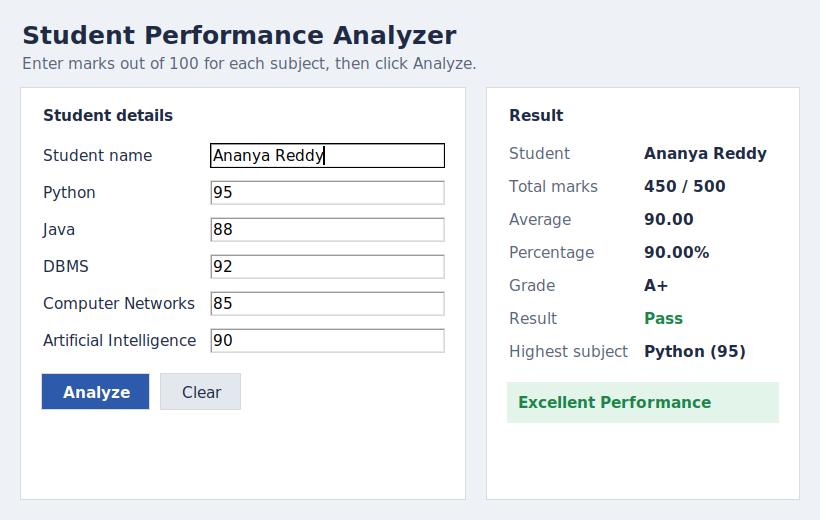

http://10.233.107.38:8501

# Student Performance Analyzer

A simple desktop application built with Python and Tkinter that helps a student or teacher enter marks for five subjects and quickly see the student's total, percentage, grade, pass/fail status and overall performance.

This is a college mini project made to practise Python basics: functions, lists, dictionaries, loops, if-else conditions, input validation and building a basic GUI.



## Features

- Enter the student's name and marks for 5 subjects: Python, Java, DBMS, Computer Networks and Artificial Intelligence
- Checks that marks are numbers between 0 and 100, and that the name contains only letters, spaces and dots
- Calculates total marks, average, percentage and grade
- Shows Pass/Fail status
- Shows the highest-scoring subject (all subjects are shown if there is a tie)
- Shows a performance message: Excellent Performance, Good Performance or Needs Improvement
- Lists subjects scored below 40, if any
- Clear button to reset the form
- Press Enter to analyze without clicking the button

## Rules used

**Grade (based on percentage)**

| Percentage | Grade |
|-----------|-------|
| 90 – 100  | A+    |
| 80 – 89   | A     |
| 70 – 79   | B     |
| 60 – 69   | C     |
| 50 – 59   | D     |
| Below 50  | F     |

**Pass/Fail:** the student passes only if they score at least 40 in every subject and their grade is not F.

**Performance message**

- Excellent Performance: percentage 80 or above (and passed)
- Good Performance: percentage 60 to 79.99 (and passed)
- Needs Improvement: percentage below 60, or failed in any subject

## Project structure

```
student_performance_analyzer/
├── main.py              # Tkinter GUI (run this file)
├── analyzer.py          # Calculation and validation functions
├── test_analyzer.py     # Unit tests for the logic
├── requirements.txt     # No external packages needed
├── README.md
├── .gitignore
└── screenshots/
    └── app_screenshot.png
```

The GUI and the calculation logic are kept in separate files so the logic can be tested without opening the window.

## How to run

1. Install Python 3.8 or higher from https://www.python.org
2. Download or clone this project and open a terminal in the project folder:
   ```
   cd student_performance_analyzer
   ```
3. Run the app:
   ```
   python main.py
   ```
   (On macOS/Linux you may need `python3 main.py`.)

No `pip install` is needed. Tkinter comes with Python on Windows and macOS. On Ubuntu/Debian, install it with:
```
sudo apt install python3-tk
```

### Running the tests

```
python -m unittest test_analyzer.py -v
```

## Sample inputs and outputs

**Example 1: Excellent student**

| Subject | Marks |
|---|---|
| Python | 95 |
| Java | 88 |
| DBMS | 92 |
| Computer Networks | 85 |
| Artificial Intelligence | 90 |

Output: Total 450 / 500, Average 90.00, Percentage 90.00%, Grade A+, Result Pass, Highest subject Python (95), Excellent Performance.

**Example 2: Average student**

Marks: Python 72, Java 68, DBMS 61, Computer Networks 58, Artificial Intelligence 66

Output: Total 325 / 500, Average 65.00, Percentage 65.00%, Grade C, Result Pass, Highest subject Python (72), Good Performance.

**Example 3: Failed in one subject**

Marks: Python 80, Java 35, DBMS 75, Computer Networks 70, Artificial Intelligence 72

Output: Total 332 / 500, Percentage 66.40%, Grade C, Result Fail, Highest subject Python (80), Needs Improvement, with the note "Below 40 in: Java".

**Example 4: Invalid inputs**

| Input | Message shown |
|---|---|
| Name left empty | Please enter the student's name. |
| Name "Ravi123" | Name should contain only letters, spaces and dots. |
| Java = abc | Marks for Java must be a number. |
| Java = 120 | Marks for Java must be between 0 and 100. |

## Technologies used

- Python 3
- Tkinter (standard library) for the GUI
- unittest (standard library) for testing

## Possible improvements

- Save results to a CSV file
- Allow entering marks for multiple students and comparing them
- Let the user add or change subjects

## Author

B.Tech CSE student — mini project for learning Python and GUI development.
